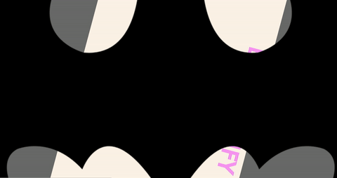

# BATMANIFY

a tiny jQuery plugin to create sweet batman transitions on your links.



## settings

__rotationSpeed__:  in degrees per 10 milliseconds.  default is 15.

__zoomSpeed__: in a percentage increase/decrease per 10 milliseconds.  default is 0.02

__imageSource__: a url.  default is batman's.  use your own???

#### usage
```
$('.my-sweet-link').batmanify({
    rotationSpeed: 15,
    zoomSpeed: 0.02,
    imageSource: 'images/batmanify.png'
  });

```
